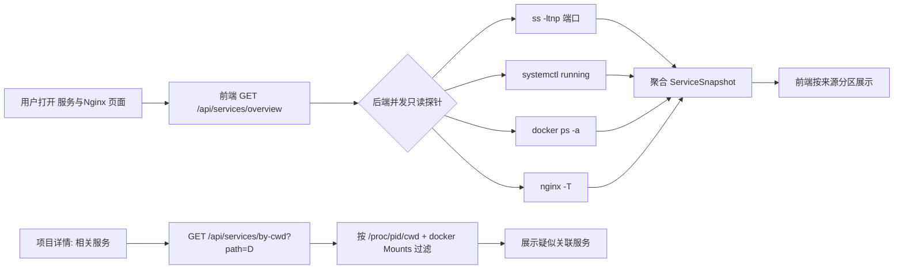

## 功能概述

在 Claude Code Board 中新增「服务与 Nginx 查看」功能（只读）。目标用户：在本机通过 Board 管理多会话、多项目的开发者。业务问题：这台云主机上 Nginx 做反代，多个项目各自跑服务（docker 容器 / systemd 服务 / 监听端口），目前没有一个统一地方看「哪些服务在跑、占用哪些端口、Nginx 怎么转发的」。本期只做**只读查看**，不做启停、不做配置编辑/reload，避免误伤运行中的服务。

## 用户角色与权限

- **管理员**（已登录 Board，复用现有 admin/JWT 鉴权）：可查看服务列表、监听端口、Nginx 配置。全部只读。
- 不新增角色。所有新 API 复用 `authMiddleware`。
- 权限边界：后端只执行**固定只读命令**（`ss`/`systemctl status`/`docker ps`/`nginx -T`），不接受用户输入拼进命令；前端不出现任何启停/编辑/reload 入口。

## 用户故事与验收标准

**US-001 查看监听端口**
作为管理员，我想看到本机所有监听端口及其占用进程，以便知道哪个端口被谁占用。
- AC1：列出所有 `LISTEN` 端口（`ss -ltnp`），显示 端口 / 协议 / PID / 进程名。
- AC2：按端口升序排序。
- AC3：高亮 Board 自身端口（3900/8700）与平台保留端口（3001/3500/8080）并加标签说明。
- AC4：命令失败时该分区降级显示「无数据/无权限」，不阻塞其它分区。

**US-002 查看 systemd 服务**
作为管理员，我想看到正在运行的 systemd 服务，以便了解系统级服务状态。
- AC1：列出 `running` 状态的 systemd 服务（`systemctl list-units --type=service --state=running`），显示 名称 / 状态 / 启动时间。
- AC2：只读，无启停按钮。
- AC3：`systemctl` 不可用时降级提示。

**US-003 查看 docker 容器**
作为管理员，我想看到所有 docker 容器及其端口映射，以便了解容器化服务。
- AC1：列出容器（`docker ps -a`），显示 名称 / 镜像 / 状态 / 端口映射。
- AC2：docker 不可用（未装/无权限）时降级提示「docker 不可用」，不报错。
- AC3：只读。

**US-004 按项目工作目录自动发现服务**
作为管理员，我在看某个 Board 项目（工作目录）时，想知道该目录下跑着哪些服务。
- AC1：给定工作目录 D，后端通过 `/proc/<pid>/cwd` 找到 cwd 匹配 D 的进程及其监听端口。
- AC2：对 docker 容器，检查其 `Mounts[].Source` / `workdir` 是否与 D 关联。
- AC3：结果标注「疑似关联」（启发式，非权威），只读展示。
- AC4：在项目详情/列表提供「相关服务」入口。

**US-005 查看 Nginx 配置（只读）**
作为管理员，我想只读查看 Nginx 配置，看清 upstream / server_name / location / 转发规则。
- AC1：执行 `nginx -T` 聚合输出，按 `server`/`location` 分段只读展示。
- AC2：支持查看 `/etc/nginx` 下单文件（只读，路径白名单在 `/etc/nginx` 内）。
- AC3：nginx 未安装时降级提示；不提供编辑/reload 入口。

**US-006 安全边界**
- AC1：所有新 API 走 `authMiddleware`。
- AC2：后端不执行任何写操作（无 restart/stop/edit/reload）。
- AC3：用户输入（如路径）做白名单校验，不直接拼进 shell 命令。

## 范围（In/Out Scope）

**In Scope**
- 监听端口列表（只读）
- systemd 运行服务列表（只读）
- docker 容器列表（只读，含降级）
- 按工作目录自动发现关联服务（只读，启发式）
- Nginx 配置只读聚合查看（`nginx -T` + 单文件）
- Board UI 新增「服务与 Nginx」页面 + 项目相关服务入口

**Out of Scope**
- 服务的启停/重启（本期不做）
- Nginx 配置编辑 / reload（本期不做）
- pm2 进程管理（用户未选；后续可加）
- 实时日志流（本期只快照，不做 tail -f）
- 跨机器管理（仅本机）
- Nginx 配置语法校验/差异对比

## 风险与待确认项

- **待确认**：docker 在这台机器上是否可用（装了/有权限）。→ 实现时探测，不可用即降级。
- **待确认**：Nginx 配置路径是否就是 `/etc/nginx`。→ 实现时用 `nginx -V` 取 `--conf-path`，回退 `/etc/nginx`。
- **风险**：只读命令在受限环境可能报权限错。→ 每来源独立 try/catch + 降级提示，不互相阻塞。
- **风险**：按工作目录关联是启发式（`/proc/<pid>/cwd` 匹配），可能不准。→ 明确标注「疑似关联」，不作为权威。
- **风险**：即便只读，后端执行 shell 仍有注入顾虑。→ 命令固定、参数白名单，不拼接自由输入。
- **安全**：不触碰平台保留端口 3001（CloudCLI）；只读查看不会影响沧溟运行。

## 核心业务流程

业务对象：`ServiceSnapshot`（一次只读快照，含 ports/systemd/docker/nginx 四区）。

状态流转：本期无写操作，无状态机；快照即时拉取，可手动刷新。

## 功能模块详细需求

**后端**
- `ServiceInspectorService`（新增，只读）：
  - `getListeningPorts()`：`ss -ltnp` 解析 → 端口/协议/PID/进程名。
  - `getSystemdServices()`：`systemctl list-units --type=service --state=running --no-pager`。
  - `getDockerContainers()`：`docker ps -a --format` 解析；docker 不可用 → 返回 `{ available: false }`。
  - `getNginxConfig()`：`nginx -T`（聚合）+ `nginx -V` 取配置路径；nginx 不可用 → `{ available: false }`。
  - `getNginxFile(relPath)`：读 `/etc/nginx` 下白名单单文件（防越权，规范化路径）。
  - `getServicesByCwd(dir)`：遍历 `/proc/*/cwd` 匹配 dir 的进程 → 关联其监听端口；docker inspect 检查 Mounts/workdir。
  - 所有方法独立 try/catch，互不阻塞。
- Routes（新增，auth 保护）：
  - `GET /api/services/overview` → 四区快照。
  - `GET /api/services/by-cwd?path=<dir>` → 按工作目录关联。
  - `GET /api/nginx/config` → 聚合配置。
  - `GET /api/nginx/file?path=<rel>` → 单文件（白名单）。

**前端**
- 新增页面「服务与 Nginx」`/services`，进入入口加到主导航。
- 四个只读卡片分区：监听端口 / systemd / docker / Nginx；每区独立 loading/empty/error。
- 监听端口表高亮 Board 端口（3900/8700）与保留端口（3001/3500/8080）。
- Nginx 分区：聚合视图按 server/location 折叠展示 + 单文件只读查看（代码高亮）。
- 项目详情/列表项加「相关服务」入口 → 调 `by-cwd`，弹层或子页展示疑似关联服务。
- 复用现有 layout、design token、auth。

## 原型描述

待生成前端预览工程后补充。
